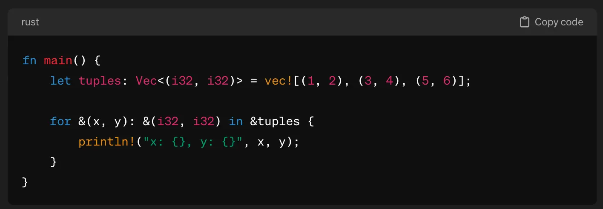

# Overview of interactions with ChatGPT

These are not *super detailed* unless it calls for it.
Provided text is not verbatim because that would be too long, and no screenshots either unless needed.

It's divided into three parts:
1. Part I-A: Initial exploration
2. Part I-B Advent of Code
3. Part II (Coming soon!)

In Part I, I used ChatGPT-3.5, and in Part II, I switched to version 4.

## Part I-A

1.1. **Question:** How to select from and run multiple `main` files in rust?

**Answer:** ✅ Use `--bin`

1.2. **Question:** I'm trying to learn rust programming language? What do you recommend as starting points?

**Answer:** ✅ List of books, official documentation, advent of code, YouTube.

**Notes:**
Afterwards, I asked the model for some actual technical topics, and not a list of resource, and I got the regular spiel about rust's features.
I knew about all of these already but I think it's a good list for someone who didn't.

1.3. **Question:** How to parse command line arguments?

**Answer:** ✅/🚫 Got some examples with `std::env`.

**Notes:**
I asked for some more powerful alternatives with reasons why.
ChatGPT told me about `clap` and with some further probing, it explained to me why it was a good choice.
Unfortunately, all code examples for `clap` were for some old version.
While they did work for that version (2.33), I want *fresh* documentation for the latest(-ish) versions of libraries (as of writing this the latest version of `clap` is 4.4.11).
ChatGPT told me that its training data cut-off was **January 2022** but the internet claims it is **April 2023**.
Go figure.
In the end, I just had to use the docs to get an arg parser going.

1.4. **Question:** How to use <insert basic feature X>, e.g. defining functions, importing from other files, conditionals, pattern matching, error handling...?

**Answer:** ✅/🚫 Code examples with explanations.

**Notes:** Sometimes I asked it something that can't be done (AFAIK), like importing multiple modules on the same line `mod mod1, mod2, mod3;` but ChatGPT was convinced it was possible.
It would give me code that either doesn't work or does something totally different.
Nudging it to fix its mistake didn't work most of the time, and I don't think spending time to get it to generate the correct answer is a) worth it and b) representative of me learning after I already googled the answer in 10s.

1.5. **Question:** Explain in detail how borrow checking and lifetimes work in rust.

**Answer:** ✅ Got decently detailed answers -- comparable to an introductory blogpost.
No complaints there.

1.6. **Question:** What kind of pointers are there in rust and how do you use them?

**Answer:** ✅ Got decently detailed answers -- comparable to an introductory blogpost.
No complaints there.

1.7. **Question:** How to read a text file in rust?

**Answer:** ✅ I got some code examples with explanations.

**Notes:** What I got was workable.
I still googled around because I wanted to check what are the alternatives and what are the most rust-idiomatic ways.
ChatGPT wasn't very good at capturing that.

1.8. **Question:** What does `?` do in rust?
**Answer:** ✅ I got high-level explanation on unwrapping `Options` and `Results`.
**Notes:** It's fine for now.
My hunch is that it won't be when I dig deeper.

1.9. **Question:** What's the best collection for keeping a growing number of elements?

**Answer:** ✅ Appaz `Vec` with some explanations how toy you use it.
Notably, some examples with `map` and `collect`.

1.10. **Question:** What's the syntax for closures and how to use them? Are there any tricky things to look out for when using closures?

**Answer:** ✅ High-level explanation.
According to ChatGPT capture mode, borrow checker and lifetimes, mutability, return type inference, size and cloning, named closures are important considerations.

**Notes:** I haven't used rust enough to know if it makes sense.
Intuitively, I can see why some of these could be tricky, some not really.

1.11. **Question:** How to map an `Iterator` of `Results`? + a bunch of follow up questions regarding `map`, `filter`, `filter_map`, differences between `?` and `unwrap`.

**Answer:** 🚫 ChatGPT just tells me to `unwrap` results when mapping an iterator.

**Notes:** This will result in `!panic` if something fails for an individual element.
I wanted to do it gracefully but `?` is weird to use.
I googled a bit and I've found good explanations of what the difference between `?` and `unwrap` is.
Then, I found out about `filter_map`.
Now, knowing what I don't know, I figured out how to formulate the question to ChatGPT, and it told me to use `filter_map`.
Quite backwards.

1.12. **Question:** Various questions regarding string slicing, finding occurrences, `Vec` and `HashMap`, closures and comparators.
**Answer:** ✅ For the most part, I think it was quite good at telling my how to do index and condition -based operations.
I did some additional searches when I wanted to look at the documentation.

## Part I-B

2.1. **Question:** How to provide inline type hints?

**Answer:** ✅ `::<T>`.

2.2. **Question:** How to use `struct`?

**Answer:** ✅ Got a good example with some explanations.

2.3. **Question:** A bunch of questions regaridng collections, e.g. `zip`, `sum`.

**Answer:** ✅ I think overall good examples of working with collections but often I'd look up more info in the documentation.

2.4. **Question:** How to use regex? How to parse strings to numbers?

**Answer:** ✅/🚫 Got fairly basic info without really explaining what is going on.

**Notes:** Searching around for examples and using the docs was much better than what ChatGPT gave me.

2.5. **Question:** Unpacking a tuple with explicit type annotations

**Answer:** 🚫 some hallucinated code that doesn't work, tells me that you can provide these but then the documentation says that you cannot lol.

2.6. **Question:** Indexing vectors, continuous slice out of a vector

**Answer:** ✅ Good, documentation-like examples of what's out there.

2.7. **Question:** Can you have multiple lines per pattern matching statement?
**Answer:** ✅ Yes, with an example.

2.8. **Question:** `HashSet` and upserting into a `HashMap`.

**Answer:** ✅ `HashSet` all good.
`HashMap` example was confusing but workable.
Used the documentation on the side.

2.9. **Question:** Slice into fixed-size array.

**Answer:** 🚫 unrelated answer.

**Notes:** This is what I wanted [link](https://stackoverflow.com/questions/37668886/slice-to-fixed-size-array).

2.10. **Question:** Build string in a loop.

**Answer:** ✅ gave me a good example with `push_str`.

2.11. **Question:** Cloning a slice of a vector of structs.

**Answer:** ✅/🚫 Gave me a generic cloning example.
But I had a `Vec<struct>` so that didn't work.
When I pointed that out (and Googled) it told me that I need to derive some traits for my `struct` so that you can clone them.
*Fine* but I had to know what to prompt to get the answer.

2.12. **Question:** How to measure the elapsed time for a block of code? How to profile time and performance of a program?

**Answer:** ✅ The former, good enough with `Instant::time`.
The latter, also fine I guess? Some standard tools like `valgrind`, `perf` and `flamegraph`.
Also, told me to try `cargo profiler`.

## Part II

**Note on updating to GPT-4:**

I reran some of the 3.5 questions on version 4.
1. ✅ It gave me the `filter_map` example.
2. 🚫 Unpacking with type annotations is still wrong and perhaps even more.
It hallucinated that it's possible.

Then I said it's incorrect.
So it gave me an example with where it reassigned variables inside the loop body and said that you can't have types while unpacking (yay?).

And I said that it was giving me conflicting info, it gave me hallucinated code again.

3. ✅ It knows that you can't have multiple modules declared on the same line `mod m1, m2, m3`.
4. 🚫 Still doesn't know about `ratatui`; allegedly, the cutoff date is April 2023.

3.1. **Question:** I want to get started with the `axum` library.

**Answer:** 🚫 Got fairly basic info without really explaining what is going on.

**Notes:** Searching around for examples and using the docs was much better than what ChatGPT gave me.
Also, the toml config example told me to install version 0.2.0; I asked if there's a newer version, and it gave me 0.3.2.
As of March 2024, the latest version is 0.7.4, and GPT provided examples don't compile most of the time.
I want to **emphasize** that lots of code samples that I get are outdated, and do not work.

3.2. **Question:** How to use `sqlite3` from Rust? What library should I use?

**Answer:** ✅/🚫 It recommended me `rusqlite` which seems to overlap with what the web says.
Simple code examples work too.
It's behind by several versions.
Also, if you generate the response multiple times, it will give you different library versions.

**Notes:** It told me to import `rusqlite` using `extern create` which is outdated by many years.
After I pointed it out, it gave me a *modern* example.

3.3. **Question:** Interacting with `sqlite3` via `rusqlite`.
Table creations, upserting and deleting records.
Anything to watch out for?

**Answer:** ✅ All good. Working code examples. Some considerations regarding (lack of) thread safety.

3.4. **Question:** How to do queues in rust? Handling `sqlite`'s single-write limitation with queues?

**Answer:** ✅ I got several options on how to do queues in rust: `async`, `tokio`, `std`.
Then I asked if queues are a reasonable approach to handle writing to an `sqlite` database.
I got a decent explanation why that would work, and a `tokio` example.

**Notes:** To me, this one was really well handled.

3.5. **Question:** `Arc`, `Mutex` and `ReadWrite`-locking.

**Answer:** ✅ Good enough for me.
I don't have much experience with async in low-level languages so I can't gauge how good these responses are ¯\\\_(ツ)\_\/¯

3.6. **Question:** Explain pattern matching in function parameters, and give some examples.

**Answer:** ✅ I got an okay explanation.

**Notes:** LLMs aside, this feature screams of code smell and obfuscation.

3.7. **Question:** Enums in rust.

**Answer:** ✅ Seemed fine.
I got some basic explanation that were satisfactory.

3.8. **Question:** I was trying to figure out how to use channels to queue up operations to the sqlite database because it's single-write.

**Answer:** 🚫 I got some weird wrapper code around database operations that didn't really make sense to me.
Also, it wasn't working.

**Notes:** I was prodding ChatGPT to explain to me what I need the wrapper for exactly, and it kept spamming me with walls of text.
Also, it had trouble singling out a piece of code and rewriting it (from a bigger block) unless I explicitly supplied the peace to be rewritten.
*Eventually*, I managed to get it closer to the code in this repo (`async/main.rs`) but it defo would have been easier if I didn't bother with the LLM.

3.9. **Question:** How to use PyO3?

**Answer:** 🚫 Of course use `maturin` and some code examples.

**Notes:** All outdated.
The way it recommends to scaffold the project is very different from the official docs.
I just used the documentation.

3.x. **Question:** abc

**Answer:** ijk

**Notes:** xyz

3.x. **Question:** abc

**Answer:** ijk

**Notes:** xyz
